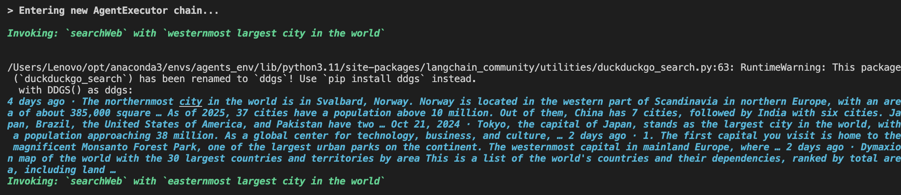

# Search Engine Agent

Hi there 👋, I've built my first Agentic Project, a Search Engine Agent, it utilizes wikipedia, and DuckDuck search website to query informational results based on the query provided. I have used OpenAI's GPT 4o mini, but you can use any LLM model with Langchain support.

## libraries 
1. Langchain
2. dotenv
3. pydantic
4. wikipidea
5. duckduckgo-search

## How to Use

To use the repo, you can clone the repository and then follow steps below
1. Install the required packages, by creating a virtual environment using conda

``conda create -n <env_name> -y python=3.11``

``conda activate <env_name>``

``pip install -r requirements.txt``

2. Once you have the packages installed, simply run the ``main.py`` script.

``python main.py``

It will prompt you to enter a query, and a successfull response would be as follows.

